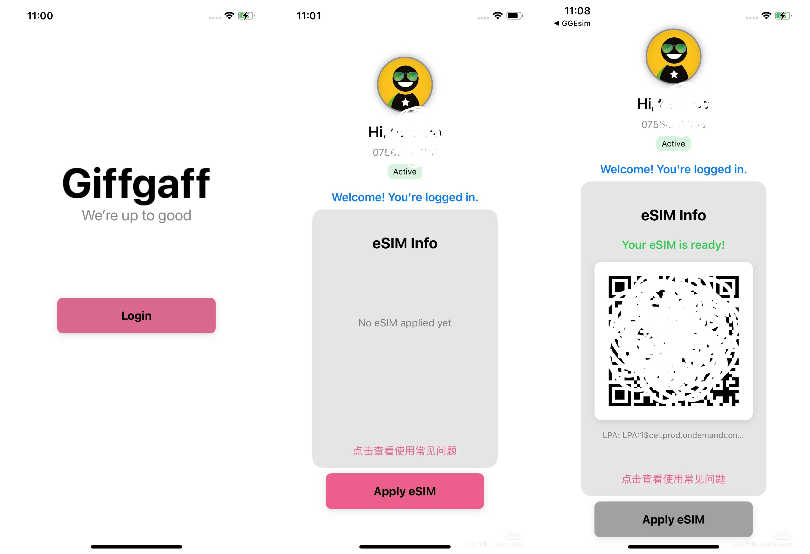

# GGEsim

将 Giffgaff 手机卡转成 eSIM 的应用。

[English](README.md) | 简体中文

## 项目简介

GGEsim 是一个帮助用户将 Giffgaff 实体 SIM 卡转换为 eSIM 的应用程序。本项目旨在简化没有 eSIM 手机的 Giffgaff 卡用户获取和使用 eSIM 的过程。

以下是 GGEsim 应用的一些截图：

## 功能特点

- 将 Giffgaff 实体 SIM 卡转换为 eSIM
- 支持 iOS 设备
- 简化 eSIM 激活流程

## 使用说明
可以参考这篇文档: https://shuzimumin.com/t/topic/102

## 贡献指南

我们欢迎社区成员为 GGEsim 项目做出贡献。如果您有任何改进建议或发现了 bug，请提交 issue 或 pull request。
如果你有需要讨论的功能也可以在上面的帖子中回复作者。

## 许可证

本项目采用 MIT 许可证。详情请参阅 [LICENSE](LICENSE) 文件。