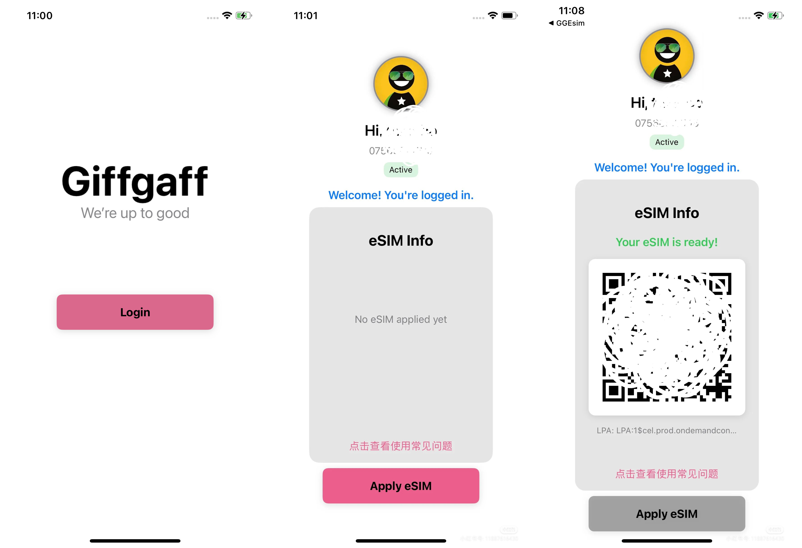

# GGEsim

将 Giffgaff 手机卡转成 eSIM 的应用。

[English](README.md) | 简体中文

## 项目简介

GGEsim 是一个帮助用户将 Giffgaff 实体 SIM 卡转换为 eSIM 的应用程序。本项目旨在简化没有 eSIM 手机的 Giffgaff 卡用户获取和使用 eSIM 的过程。

以下是 GGEsim 应用的一些截图：



## 功能特点

- 使用 Giffgaff OAuth 与 PKCE 登录，持久化 Token，并在过期或收到 401 时自动刷新重试
- 在伦敦服务时间内，通过短信 MFA 和 SIM swap 将 Giffgaff 实体 SIM 转为 eSIM
- 为无 SIM 的账号预留新 eSIM、管理已绑定支付方式，并通过 Giffgaff 登录态网页收银台完成激活
- 展示 eSIM 下载二维码和 LPA 字符串
- 支持导出诊断日志、打开使用指南和提示网络异常
- iOS 与 Android 客户端功能对等

## Android 配置

使用 Android Studio 打开 `Android-Client`，参考
`Android-Client/local.properties.example`，在不纳入版本控制的
`Android-Client/local.properties` 中配置 `GGESIM_CLIENT_ID` 和
`GGESIM_CLIENT_SECRET`。Android 客户端已对齐 iOS 客户端的 Giffgaff
OAuth、实体卡转 eSIM、无卡订购与支付、二维码下载流程。命令行构建需要
JDK 17 或更高版本，也可以直接使用 Android Studio 自带的运行时。
`GGESIM_GUIDE_URL` 为可选配置，默认指向下方使用说明。

连接模拟器或 Android 设备后，可运行完整本地验证：

```shell
./gradlew testDebugUnitTest connectedDebugAndroidTest lintDebug assembleRelease
```

## 使用说明
可以参考这篇文档: https://shuzimumin.com/t/topic/102

## 贡献指南

我们欢迎社区成员为 GGEsim 项目做出贡献。如果您有任何改进建议或发现了 bug，请提交 issue 或 pull request。
如果你有需要讨论的功能也可以在上面的帖子中回复作者。

## 许可证

本项目采用 MIT 许可证。详情请参阅 [LICENSE](LICENSE) 文件。
